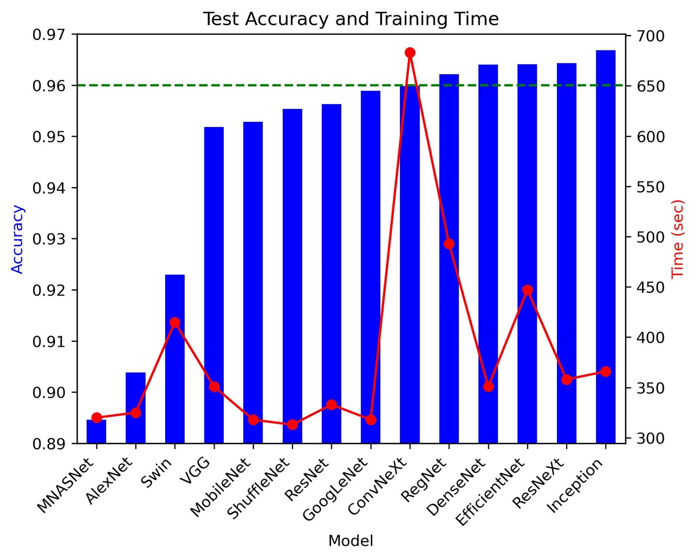

  # Cervical Spine Fracture Detection

  
  

## Overview

- This project employs deep convolutional neural networks to detect fractures in CT images of the cervical spine.

## Dataset

- The dataset is retrieved from [kaggle](https://www.kaggle.com/competitions/rsna-2022-cervical-spine-fracture-detection).

## Code

- `src/vertebrae-detection.ipynb`: vertebra type classification on each 2D slice.
- `src/fracture-detection.ipynb`: fracture existence detection on the slice-level, vertebra-level, and patient-level.
- `src/fracture-localization.ipynb`: fracture localization with FastRCNN.

## Results

  
  

