

  # Facial Expression Recognition with Label Distribution Learning

## Objectives
This research project is focused on **Facial Expression Recognition (FER)** technology. Deep learning models for human emotion prediction based on facial expressions are constructed and optimized based on several different model architectures, and many optimization techniques are carried out with their effectiveness evaluated in the model training process.
This project also investigates the advantages of label distribution learning for FER model, by applying multi-label facial image data to train the model, and measuring the accuracy increase of the multi-label learning scheme compared to the single-label version.

## Data Source
- [FERPlus](https://github.com/microsoft/FERPlus): the main dataset used in this project for model training and evaluation, which is a collection of approximately 35k facial grayscale images retrieved from another dataset [FER](https://www.kaggle.com/c/challenges-in-representation-learning-facial-expression-recognition-challenge/data), each annotated by ten taggers into one of ten emotion categories: neutral, happiness, surprise, sadness, anger, disgust, fear, contempt, unknown, not a face.
- [ImageNet](https://www.image-net.org/), [AffectNet](http://mohammadmahoor.com/affectnet/): datasets for model pre-training.
- [SFEW](https://cs.anu.edu.au/few/AFEW.html), [RAF-DB](http://www.whdeng.cn/raf/model1.html): additional training data.

## Tools
- Numpy, Pandas: for data exploration and processing.
- Tensorflow, Keras: for VGG model construction and the implementation of optimization methods.
- Pytorch: for implementation of advanced FER models.
- Dlib: for face detector and ERT-based face alignment model.

## Data Distribution of FERPlus

- Label distribution: the proportion of each emotion label given to the images in FERPlus.

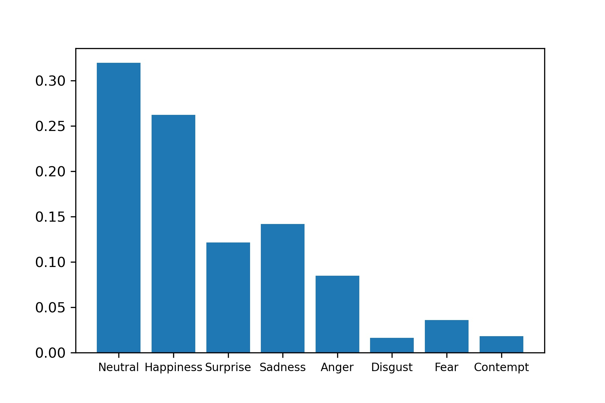

### 
- Image complexity distribution: complexity of an image here is defined as the number of emotion tags assigned to the image.

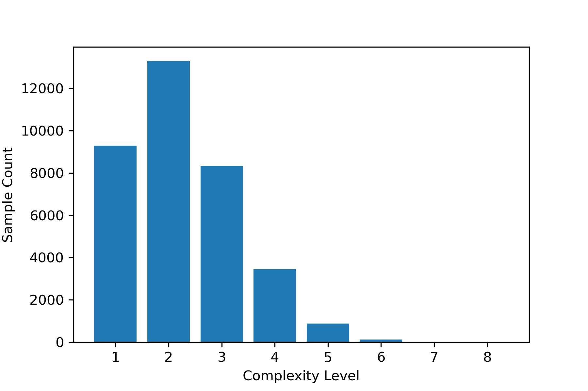

# Data Preprocessing

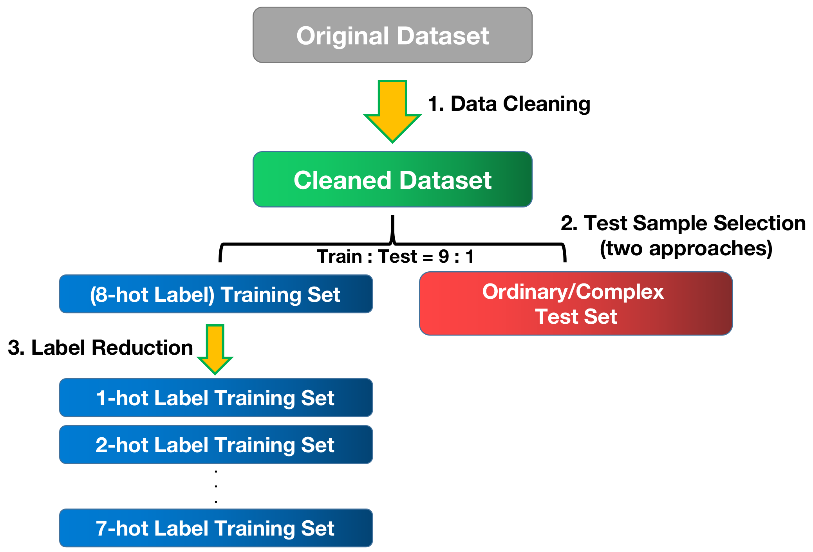

1. Data Cleaning: Non-facial images and images with unknown emotions are removed. Only eight specific emotions (neutral, happiness, surprise, sadness, anger, disgust, fear, contempt) are retained.
2. Train-Test Split: Separate dataset into a training set and a test set in two different ways.
    - Stratified Train-Test Split: obtain an ordinary test set.
    - Split by Complexity: obtain a complex test set in which test images consist mostly of complicated emotions.
3. Label Reduction: Reduce the labels of training images by setting the target probability of the least likely emotion to 0, keeping the number of positive emotion responses under a threshold N. (Randomly pick an emotion to zeroize if a tie exists.) Obtain N-hot label training datasets (N = 1, 2, ..., 8).

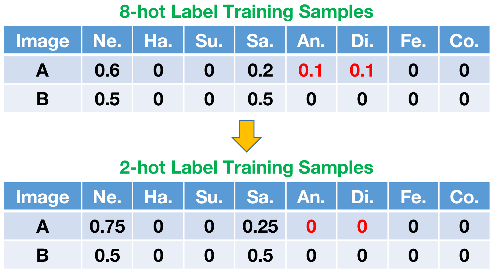

# Accuracy Improvement Methods

## Training Data Processing
1. Data Augmentation: increase training sample size by applying random rotation and horizontal flipping.

- Test result on VGG16 (B: baseline training set. F: flipped image set. R: rotated image set. RR: random rotation.):

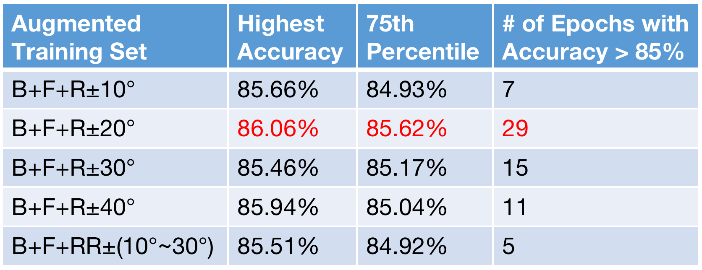

 

2. Face Alignment: detect and align the faces by ERT-based alignment technique before feeding images to the model.

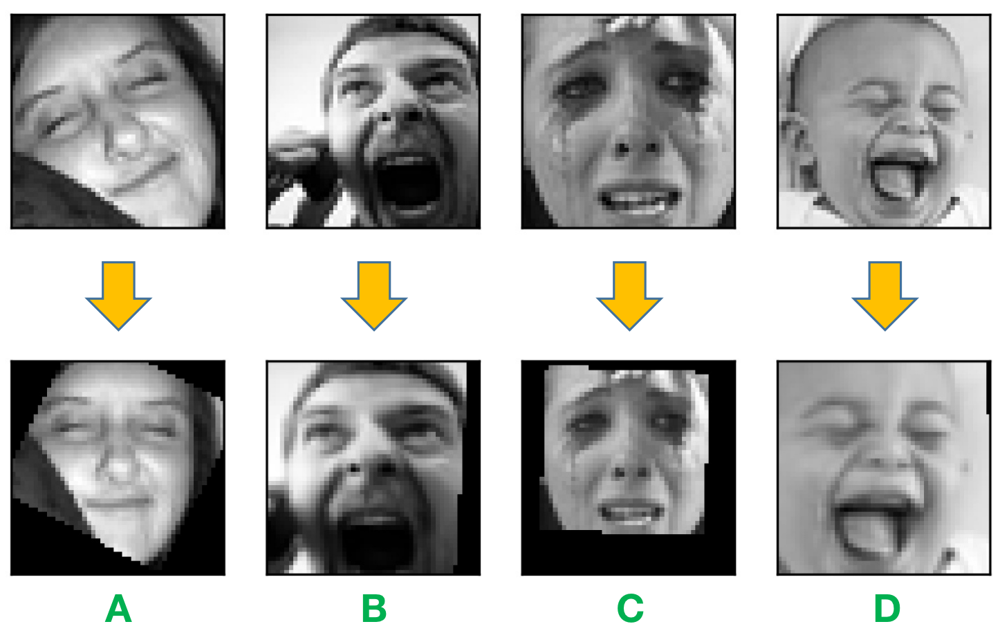

- Test result on VGG16: approximately 0.5% of accuracy increase.

## Model Training Scheme
1. Loss Function

- Test result on VGG16:

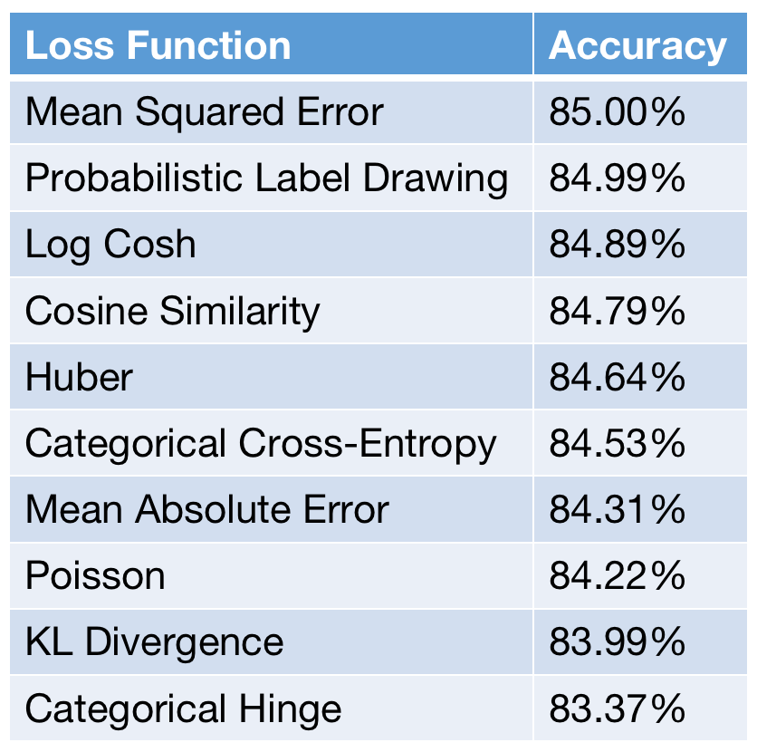

2. Weight Initailization by Model Pre-training

- Test result on VGG16 (IN: pre-trained by ImageNet. AN: pre-trained by AffectNet. IN-AN: pre-trained by ImageNet and AffectNet):

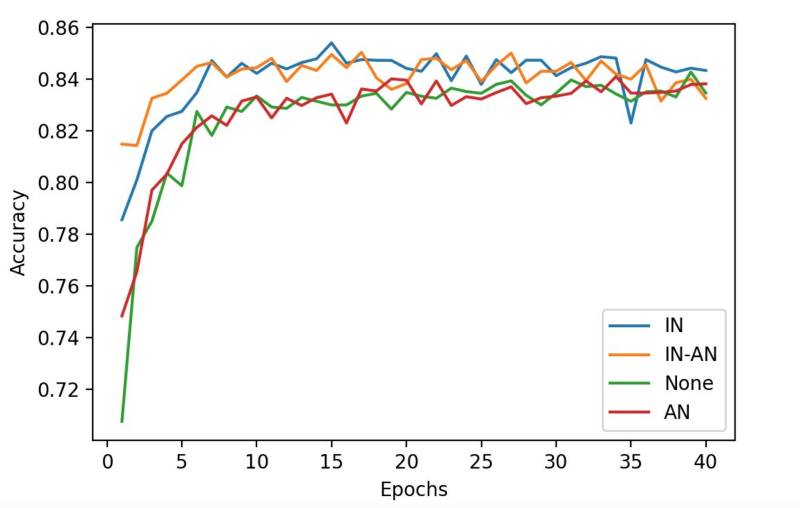

3. Hyper Parameter Tuning: dropout, learning rate, optimizer, model layer structures, etc.

(See the [project report](https://drive.google.com/file/d/1ti-aA3u8cVBTwc1EDlIKhbtv5eitGjOl/view?usp=sharing) for more details, including the effectiveness of optimization techniques on advanced models.)

# Experiment Results
## Model Comparison
1. Classical CNN Models

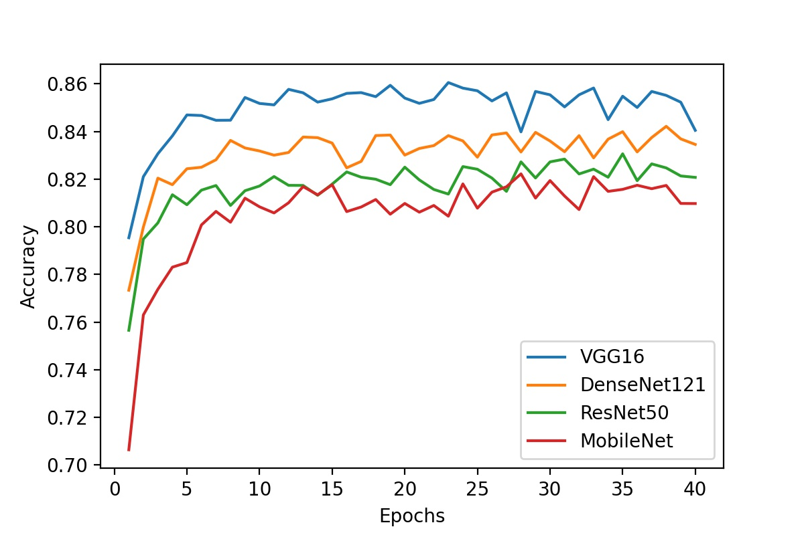

2. Advanced CNN Models (compared to VGG)

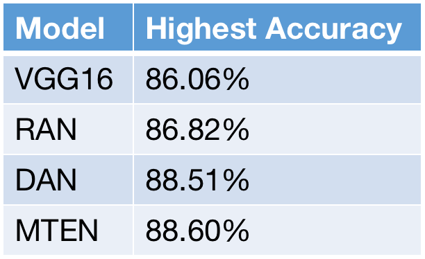

## Effect of Label-Distribution Learning 
1. Ordinary Test Set
- N: maximum number of labels (positive emotions) retained in the training samples.

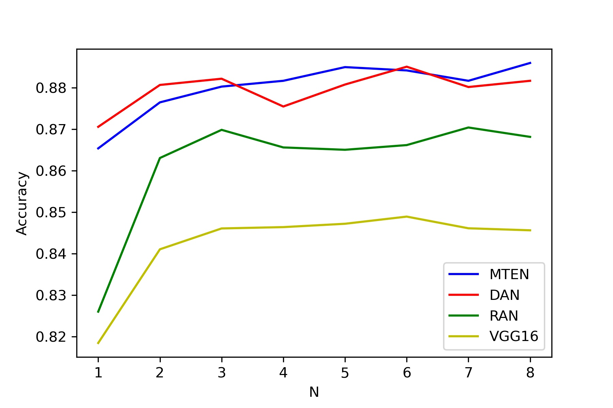

2. Complex Test Set
- Solid lines: ordinary test set (as comparison).
- Dashed lines: complex test set.

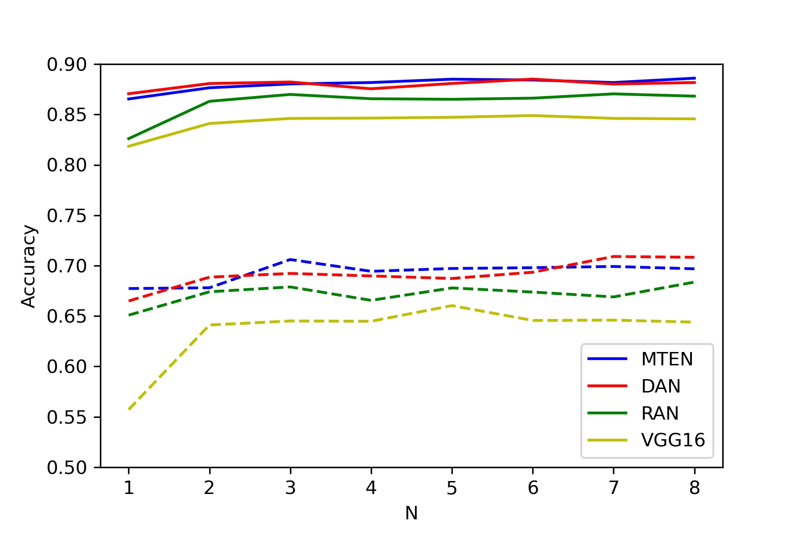

# Conclusion
Considering the complexity of human emotions, a single emotion label can hardly fully represent a person's feelings. More often than not, a person shows multiple emotions at the same time. Due to this reason, an emotion distribution should be the more proper way to represent the characteristics of the facial image.

**Adopting label distribution learning, the model learns more information from the training data, and accuracy rises correspondingly.** The test results revealed that a maximum of 2 or 3 emotions per image is already showcasing great improvement on the model accuracy, and further increasing the labels attached made relatively little contribution. This is consistent with the fact that most people could betray no more than 3 basic emotions at the same time, as suggested by the complexity distribution of FERPlus dataset.

**The accuracy increment by label distribution learning is especially remarkable when the model is to evaluate complex facial images.** As shown by the experiment result, when evaluating complicated faces, model performance degrades dramatically if trained by single-label images (10% accuracy decrease for traditional models like VGG16). 

The lesson that can be learned is that, in order to construct a powerful FER model, a model that is more robust when being tested by complicated facial expressions (which often constitute a great proportion of facial images in the wild), label distribution learning considerably outperforms single-label learning, in the sense that they provide a more accurate and comprehensive depiction of human faces.

However, the situation is that most currently available facial image datasets do not adopt multi-label tagging for their sample images, i.e., only giving a single label to each face. No more than a few small-scale datasets ([FERPlus](https://github.com/microsoft/FERPlus), [RAF-DB](http://www.whdeng.cn/raf/model1.html), [RAF-ML](http://whdeng.cn/RAF/model2.html)) attempted to give facial images multiple labels. This might be due to the extra time and labor required to build such a dataset. **The lack of multi-label facial images hinders the construction of accurate FER models.**

# Future Work

The future work includes tagging more facial images by multiple labels, designing more advanced label distribution learning algorithm, and **creating models that are focused on predicting minor emotions of people**. If the lack of multi-label data is unsolvable in a short time, a model can be devised to automatically **predict the minor emotions** (i.e., second and third most likely emotions) shown by a face. Then, the off-the-shelf single-label datasets can be upgraded to a multi-label version, contributing to FER model training in the future.
